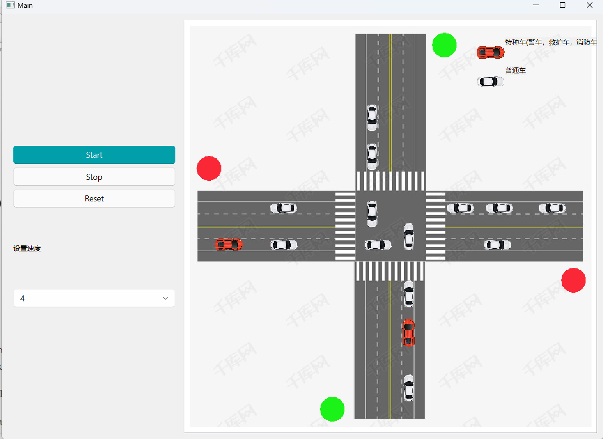
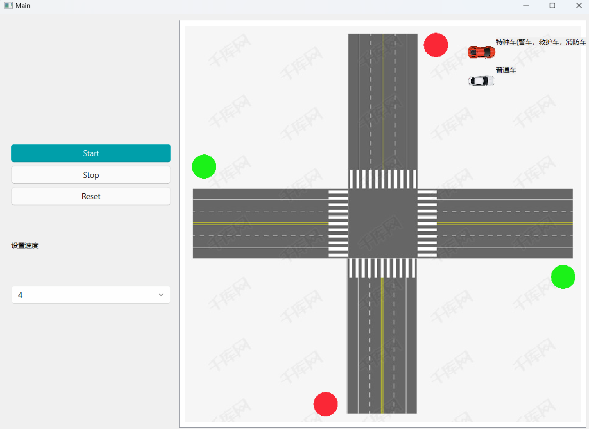

# Operating System Course Project - Intersection Vehicle Scheduling Control

[TOC]


## Introduction

This project is the intersection traffic light control system for the spring semester 2023 operating system course project of Tongji University School of Software 

Project Purpose：

* Be familiar with thread/process synchronization mechanism 
* Understand signal volume mechanism 
* Understand multi-thread/process scheduling 
* Understand and appreciate the concept of multi-threading 
* Design intersection traffic light control system



## Functions

* Car scheduling control at crossroads
* Display and automatic switching of signals and control of whether vehicles can enter the intersection
* Randomly generate four lanes of regular and special vehicles and drive in the specified direction
* Control functions such as start pause reset and control car speed

## Features

* Implemented vehicle scheduling at intersections and solved deadlocks
* The animation is complete and vivid, which can show the vehicle operation and scheduling, and solve the deadlock visualization situation
* Good class/function design and encapsulation, low program coupling, high code reusability, high maintainability, good readability
* Can start pause reset screen, also can control the speed of the car
* Standard output stream (cmd) with log output, you can view the dynamics of scheduling
* Simulation of traffic functions, randomly generated car types or not, probability, etc. can be modified in  `config.py`

## Build

```
pip install -r requirements.txt 
```

and from [here](https://github.com/zhiyiYo/PyQt-Fluent-Widgets/tree/PyQt6) to download ***PyQt-Fluent-Widgets=0.7.1*** for PyQt6

```
python start.py
```



## Operations

You can start/continue the simulation, pause the simulation, reset the scenario, and also set the speed at which the vehicle will travel，the car is randomly generated.


