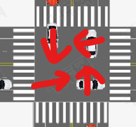

# 十字路口车辆调度控制--项目报告

[TOC]

# 项目简介

本项目为同济大学软件学院2023年春季学期操作系统课程项目的十字路口交通灯控制系统

## 项目目的

* 熟悉线程/进程同步机制 
* 理解信号量机制 
* 理解多线程/进程调度 
* 体会并理解多线程概念  
* 设计十字路口交通灯控制系统

## 项目环境

* 开发环境
  python pyqt6
  win11
* 运行环境
  win11
* 运行方法
  运行根目录下的start.exe即可

# 项目功能


* 十字路口的汽车调度
* 信号灯的显示和自动切换以及控制车辆是否能进路口
* 随机生成四个车道的普通车和特殊车辆并且按规定方向行驶
* 开始暂停重置等控制功能和控制汽车速度

# 系统架构

主要分为实体模块，控制模块和显示模块，控制模块控制信号量资源的分配释放，控制实体模块中各实体的实时行为以在显示模块上显示

实体模块主要包括路口，车辆，道路和红绿灯

控制模块包括场景中所有对象的帧动画控制，还有画面的总体控制等

显示模块就包括了场景上对象及其动画的显示

# 模块设计

## 实体模块

### 路口

路口划分为4个区域，每个区域存储一个数值为1的信号量，代表同时只能有一辆车在该区域行驶，同时记录每个区域上的车信息和检测到死锁的状态


### 车辆

有两种类型，普通车和特殊车，特殊车辆可以无视红灯

同时车辆有4种状态，这四种状态是控制模块控制的关键

| 状态   | 描述                                     |
| ------ | ---------------------------------------- |
| Normal | 车在进入十字路口之前的时候的状态         |
| Cross  | 车在得到信号量资源穿行在十字路口种的状态 |
| Out    | 车即将离开或者离开十字路口的状态         |
| Wait   | 车在等待路口信号量资源时的状态           |

同时车上还记录了所持有的信号量资源信息，车的编号，车的行驶方向等信息

### 道路

记录一个行驶方向上车辆的生成位置，信号灯，还有该方向上的所有车辆，还有该道路的方向

### 红绿灯

每条道路上设置一盏红绿灯，记录着红绿的状态

## 控制模块

### 计时器

包含三个计时器，计时器到指定时间会执行指定代码

| 计时器      | 计时器到指定时间的功能                     |
| ----------- | ------------------------------------------ |
| signalTimer | 更新红绿灯，其中南北红绿灯，东西红绿灯同步 |
| carTimer    | 随机在四个方向的路上生成普通车或特殊车     |
| frameTimer  | 每帧更新车辆的位置，连成动画效果           |

### 整体控制功能

有4个整体控制功能

| 功能     | 描述                     |
| -------- | ------------------------ |
| Start    | 计时器启动，画面开始播放 |
| Stop     | 计时器停止，画面停止     |
| Reset    | 更新画面回初始状态       |
| SetSpeed | 修改汽车移动的速度       |

### 每帧更新车辆的位置

其中会遍历每个方向的道路上的所有车检查包括该车现在所处的状态，该车的位置是否进/出十字路口的每个区域，该车拥有的路口区域资源，以及该车和前车的关系，该车方向上的红绿灯和该车类型状态等，具体如下

| 检查                         | 功能                                                  |
| ---------------------------- | ----------------------------------------------------- |
| 该车所处的状态               | 判断该车是否移动的依据，是否获取/释放信号量资源的依据 |
| 该车拥有的路口区域资源       | 判断该车是否能够在路口中移动的依据                    |
| 该车的位置是否进/出路口      | 判断是否给该车开线程申请/释放区域资源的依据           |
| 该车和前车的位置关系         | 判断是否要停车等待前车驶出安全距离的依据              |
| 该车方向上的红绿灯和该车类型 | 判断该车是否要在路口前停止等待的依据                  |

### 进/出路口信号量资源的申请和释放

同时，关于进/出路口信号量资源的申请和释放，有如下详情：

```python
def __Go(self, car: Car, areaID: int):
        """
        Get the resources of a block
        """
        car.SetStatus(CARSTATUS.Wait)
        self._cross.GetSig(areaID).acquire()
        print(f"({areaID}): " + str(car.GetNum()))
        self._cross.SetCar(areaID, car)
        car.SetStatus(CARSTATUS.Cross)
        if car.GetResource() != None:
            if car.GetP() == False:
                self._cross.SetCar(car.GetResource(), None)
                self._cross.GetSig(car._resource).release()
            car.SetPrev(car.GetResource())
        car.SetResource(areaID)
```

申请一个区域资源是开一个子线程进行的，否则会阻塞主线程，申请一个区域资源的时候会首先将汽车的状态置为等待状态然后再尝试阻塞申请信号量（顺序有要求），得到资源后会将路口该区域的车信息写成该车，然后修改该车的等待状态为穿越路口状态，最后会将该车的持有资源的标识上写上该区域，其中if中的语句是如果该车已经持有了一个资源（即是从路口的一个区域到另一个区域），此时该车已经取得了另一个区域的资源，所以要把之前的资源释放掉，同时将其记录为上一个资源，GetP()方法是解决死锁中用到的取得标识，一般情况都为False

```python
def __Out(self, car: Car, areaID: int):
        self._cross.SetCar(areaID, None)
        self._cross.GetSig(areaID).release()
        car.SetStatus(CARSTATUS.Out)
        car.SetResource(None)
```

出路口释放一个车所有的资源首先将其从路口指定的区域删除（这里注意顺序，否则可能导致线程不安全），然后释放指定资源，设定其状态为Out并且指定其现在拥有的路口资源为None

# 算法设计

本项目算法主要是想解决线程饥饿和死锁两个问题

## 饥饿

路口四个区域信号量的分配中有某个方向的车一直不能抢占到相应的路口区域资源，导致进入不了路口或者在路口的某个区域一直停下等待资源

* 采用FCFS(First-Come, First-Served) 算法，因为一辆汽车经过路口的一个区域的时间很短很平均，因此满足先到先等待先得可以让平均等待时间最少，让每辆车的等待时间都差不多，不会出现一辆车等待某个资源等待的时间比其他车长很多的情况，也避免了饥饿

## 死锁

如下示意图的情况会发生死锁，四辆车循环索取对方的资源，导致堵塞



* 采用检测死锁的方法，当四个区域上的车同时处于等待资源的状态并且1车向北，2车向西，3车向南，4车向东时，则必定是死锁，检测到死锁之后，同时放开四个区域的信号量资源并且标记该四辆车，放开的四个区域的信号量资源此时只能被标记的车线程抢占（要是被即将进入路口但是不是造成死锁的四辆车中的一辆车线程抢占的话该车会释放资源继续等待），这样四辆车同时获得了对应的资源，同时前进相互错开以解决死锁，同时，检测到死锁就解决相比于预防死锁的方式，检测到死锁后及时解决的方式实现比较简单，不需要对系统进行大量的修改和调整。同时预防死锁可能不太容易，或者在复杂的系统中可能会存在死锁，这时采用死锁恢复的方式可以处理这些复杂的情况。同时最大化利用系统资源，提高系统的资源利用率

# 项目总结

## 项目亮点

* 实现了十字路口的车辆调度并且解决了死锁
* 动画完整生动，能够展示车辆运行和调度，解决死锁的可视化状况
* 类/函数设计和封装较好，程序耦合度低，代码复用性高，可维护性高，可读性好
* 可以开始暂停重置画面，还可以控制汽车的速度
* 标准输出流(cmd)具有日志输出，可以查看调度的动态
* 模拟交通功能，随机生成汽车种类或者不生成，概率等都可以在`config.py`中修改

## 改进方向

* 可以设置红绿灯为动态改变持续时长，比如某条方向车流比较多绿灯时间会变长等
* 设置每辆车的速度不同，改进路口调度算法为抢占式优先级调度算法，随着等待时间的增长优先级会变大，从而实现每辆车的等待时间平均
* 可以增加功能比如车辆左右转拐弯之类的或者说可以自行添加指定类型和速度的车辆到自定义的路上
* 增加多条车道，增加路口内划分区域的个数

